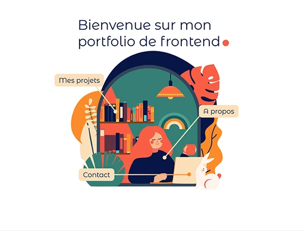
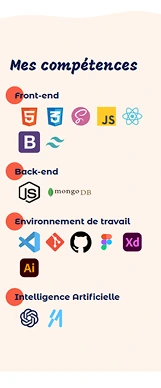

# PORTFOLIO

<i>Travail réalisé from scratch, dans le but de me présenter, présenter mes projets et réalisations, de lister mes compétences et de les démontrer au travers du code du site lui-même. 
Ce projet constitue à la fois un projet personnel et un projet professionnel, projet de fin de formation "Développeur Web" d'OpenClassrooms.</i>

  
  

## 🎯 Objectifs
- **Déployer** un site statique en ligne
- Mettre en avant mes réalisations et mes compétences techniques
- **Expérimenter** des librairies et animations,
- Créer une **identité professionnelle**",
- **Améliorer** mes compétences en design et performance"
  

## 💡 Technologies utilisées
- HTML5
- CSS3
- React
- TailwindCSS
- Motion
- Material UI
- Figma
  

## 📂 Structure
📁 OC_P8_PORTFOLIO 
│── 📁 public/  
│── 📁 src/  
│    └── 📁 assets/  
│    └── 📁 components/  
│    └── 📁 data/  
│    └── 📁 pages/  
│    └── App.jsx/  
│    └── main.css/  
│    └── main.jsx/  
│── index.html  
│── README.md
  

## 💻 Démonstration en ligne
👉 Voir le site en ligne [ICI](https://helenecanovas.fr)
👉 Voir la maquette Figma [ICI](https://www.figma.com/design/vImZhMZO6I7kNVAPzkKtbG/Portfolio?node-id=0-1&m=dev&t=55it6kj4r0KLcI9k-1)
  

## 📝 Notes additionnelles
- Ce projet offrant une plus grande liberté j'ai décidé d'utiliser les frameworks React et Tailwind CSS pour le développement du site. Cette solution me permet de concevoir un portfolio statique et dynamique rapidement et de manière optimisée et performante. Egalement pour le rendre plus attrayant, et l'animer facilement j'ai utilisé la librairie Framer Motion ainsi que les animations de React-Wavify.
- Pour la conception des différentes pages du portfolio, j'ai utilisé Figma ainsi qu'Illustrator afin de personnaliser mes images vectorisées.
- Ce projet ayant pour but d'entrer en contact avec de futurs employeurs et collègues, le formulaire de contact intégré est fonctionnel et facile à utiliser. Il nous permettra de communiquer si vous le souhaitez !"
  

## 📬 Contact
Pour toute question ou suggestion, n'hésitez pas à me contacter sur [LinkedIn](https://www.linkedin.com/in/helene-canovas-48710b141/)